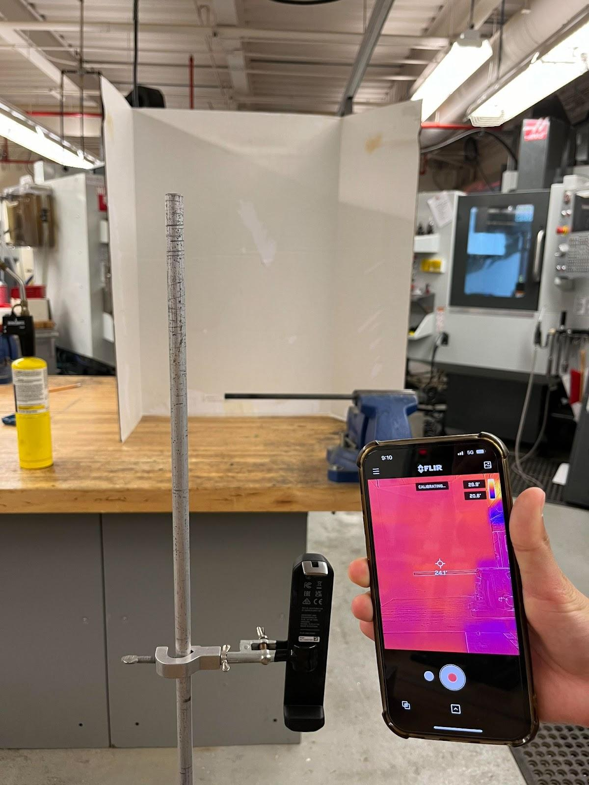

# Using Physics-Informed Neural Networks to Model the 1D Heat Equation

## Project Description
Partial differential equations (PDEs) are used in a variety of field and applications; however, they lack closed-form solutions and require methods of approximation. Alongside mathematical approaches to approximation, computational tools like physics-informed neural networks (PINNs) have emerged. PINNs leverage a physics-based error term in addition to a typical mathematics-based error term to achieve a higher accuracy. This project aimed to model the 1D heat equation ($\frac{\partial u}{\partial t}=k\frac{\partial ^2 u}{\partial x^2}$) by training a PINN on the heat transfer across a steel rod. 

Experimental setup of collecting data of heat transfer across the steel rod.

## Tools Used
* Data Collection: Steel 1018 rod, FLIR ONE Edge Pro camera, Blowtorch
* Data Processing: OpenCV, Numpy
* Neural Network: Tensorflow, Matplotlib, Google Colab

## Table of Contents

`data-processing`: Converting rgb values to temperatures. Data is scaled where time $t \in [0,29]$ and position $x \in [0,24]$.

`data`: Data used as inputs for training the PINN. Data is formatted as $(t, x, u(t,x))$, where $u(t,x)$ represents the temperature at time $t$ and position $x$. 
* `tx_bnd_dn` and `tx_bnd_up` contain the boundary conditions on each end of the rod ($u=0$ and $u=24$).
* `tx_ini` contains the boundary conditions for when $t=0$.
* `tx_eqn` contains equally spaced data across $t$ and $x$.

`pinn`: Construction of neural network.
* Keras network model with 6 hidden layers, each with 32 neurons.
* Hyperbolic tangent activation function.
* L-BFGS-B optimization algorithm - maintains an approximation of the inverse Hessian matrix using a limited amount of computer memory.
* The physics error term the model seeks to minimize is $\frac{\partial u}{\partial t}-k\frac{\partial ^2 u}{\partial x^2}$, where $k$ is the specific heat of the steel rod.

`outputs`: Graphs depicting PINN performance. The model was trained on Google Colab T4 GPU for 60 seconds.
* `predictions`: Neural network predictions for three temperal snapshots.
* `tx-distribution.png`: Distribution of neural network prediction across $t$ and $x$.
* `tx_error.png`: Error of neural network predictions, calculated as $E=p-e$, where $p$ represents the predicted temperature and $e$ represents the expected temperature.

_Created by Mihika Dusad, Michelle Kang, Emi Zhang, and Laura Zhang as members of the [Thomas Jefferson High School for Science and Technology Quantum Information and Optics Lab](https://qlab.sites.tjhsst.edu/)._
